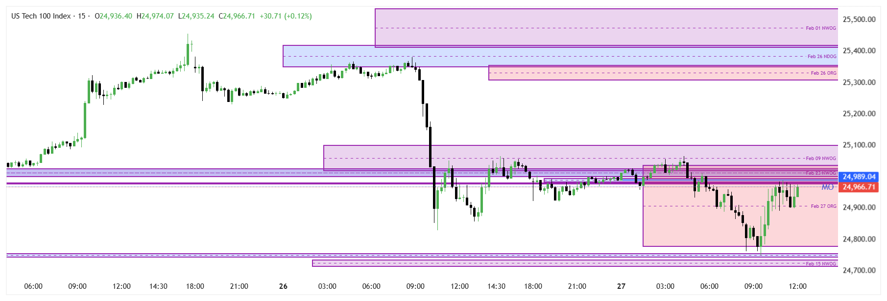

---

# 💹 Trading Session: 

> [!CHECKLIST] ## 1. Pre-Market Context , Liquidity and Execution(15M)> 
> - [x] **Trend Direction:** Mark Daily, 4H, 1H for Direction.
> - [x] **Dealing Range** Mark Yesterday's High/Low, Asian Range, London and NY Swing High/Low.
> - [x] **Identify IDM:** Mark the most recent **Valid Pullback** (mechanical candle break).
> - [x] **Premium/Discount:** Draw Fib from Swing Low to High. Is IDM in the Discount?
> - [x] **The Sweep:** Has the 15M price traded through the IDM? 
> - [x] **1M MSS:** Look for displacement + candle close above/below short-term structure.
> - [ ] **FVG Entry:** Mark the 1M Fair Value Gap.
> - [ ] **Risk/Reward:** SL below the 1M sweep low. Target 15M External High/Low.
> 
## 📝 Session Notes & Screenshots
*Paste your chart screenshots here (WIN/LOSS/NO-TRADE)*
